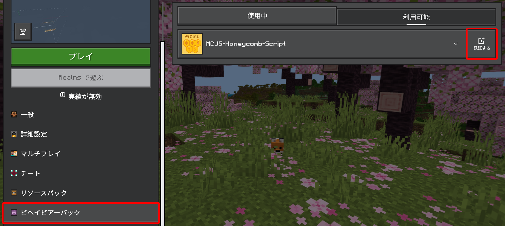

# MCJS-Honeycomb-Script
Minecraft Bedrock EditionのScripting APIにカスタムイベントなどを追加するためのテンプレートプロジェクト  
[ドキュメント](./docs//index.md)

## セットアップ
※このテンプレートはTypescriptで書かれています。Node.jsとnpmが必要です。  [Node.jsとnpmをインストールする](https://nodejs.org/)
1. このリポジトリをクローンします。  
    ```
    git clone https://github.com/ken6028/MCJS-Honeycomb-Script.git
    ```
2. `development_behavior_packs`ディレクトリ内にテンプレートを配置します。
3. プロジェクトのルートディレクトリに移動し、依存関係をインストールします。
   ```
   npm install
   ```
4. `manifest.json`の`uuid`を変更します。

## 開発
開発中は、以下のコマンドでビルドと監視を行うことができます。
```
npm run dev
```


## 有効化
ワールド編集のビヘイビアーパックから、パックを有効化してください。  



## プレイヤーのカスタムイベントを使用する例
```typescript main.ts
import { MCManager } from "./_honeycomb.script/mc.manager.js";

const manager = new MCManager();

//MGR-プレイヤー
import MGR_Player from "./_honeycomb.script/player/mgr.js";
const playerManager = manager.use(MGR_Player);

//PLG-プレイヤー入力
import Input from "./_honeycomb.script/player/plug.input.js";
playerManager.use(Input);


//ジャンプ開始イベントを受け取る
manager.on("playerInput:jumpStart", (ev) => {
    const wrapper = ev.wrapper;

    wrapper.player.sendMessage("Jump started!");
});
```
この例では、プレイヤーの管理を行う`MGR_Player`(マネージャー)と入力イベントを追加する`Input`(プラグイン)を使用しています。  
プラグインを使用するには、基盤となるマネージャーを使用する必用があります。  


## プラグインを作成する例
```typescript plug.player.level.ts
import { PlayerPluginEntry, PlayerWrapper } from "./_honeycomb.script/player/mgr.js";


const plug: PlayerPluginEntry<void> = (core) => {
    const manager = core.MCManager();
    const playerManager = core.playerManager;

    //初期化
    manager.on("playerManager:addPlayer", (ev) => {
        const { wrapper } = ev;
        wrapper.plugLevel = {
            lastLevel: wrapper.player.level
        }

    });


    //毎tickごとにレベルを監視して、変化があればイベントを発火する
    manager.on("tick", () => {
        const players = playerManager.allPlayers;

        players.forEach((wrap) => {
            const player = wrap.player;
            const level = player.level;

            if (wrap.plugLevel.lastLevel !== level) {
                //coreからイベントを発火する
                core.emit("playerLevelChange", {
                    wrapper: wrap,
                    oldLevel: wrap.plugLevel.lastLevel,
                    newLevel: level
                });
                wrap.plugLevel.lastLevel = level;

            }

        })

    })
    
}


export default plug;


declare module "./_honeycomb.script/player/mgr.js" {
    interface PlayerWrapper {
        plugLevel: {
            lastLevel: number;
        }
    }
}


declare module "./_honeycomb.script/mc.manager.js" {
    interface EX_EventDataMap {
        "playerLevelChange": {
            wrapper: PlayerWrapper;
            oldLevel: number;
            newLevel: number;
        }
    }
}
```
この例では、プレイヤーのレベルの変化を監視するプラグインを作成しています。  
プレイヤーが追加されたときに、`plugLevel`というプロパティを`PlayerWrapper`に追加して、最後のレベルを保存します。  
毎tickごとに全プレイヤーのレベルをチェックし、変化があれば`playerLevelChange`イベントを発火します。  
```typescript main.ts
import LevelPlugin from "./plug.player.level.js";
playerManager.use(LevelPlugin);
//イベントを受け取る
manager.on("playerLevelChange", (ev) => {
    const { wrapper, oldLevel, newLevel } = ev;
    wrapper.player.sendMessage(`Your level changed from ${oldLevel} to ${newLevel}!`);
});
```

## プラグインの構造
プラグインのファイル名は`plug.〇〇.ts`の形式にしてください。  
`plug.〇〇.ts`以外のファイル名を使用すると、追加されたイベントやプロパティがプラグイン使用時以外にも補完されてしまいます。  
それ以外のファイル名を使用する場合は、`tsconfig.json`の`exclude`にファイルを追加してください。  